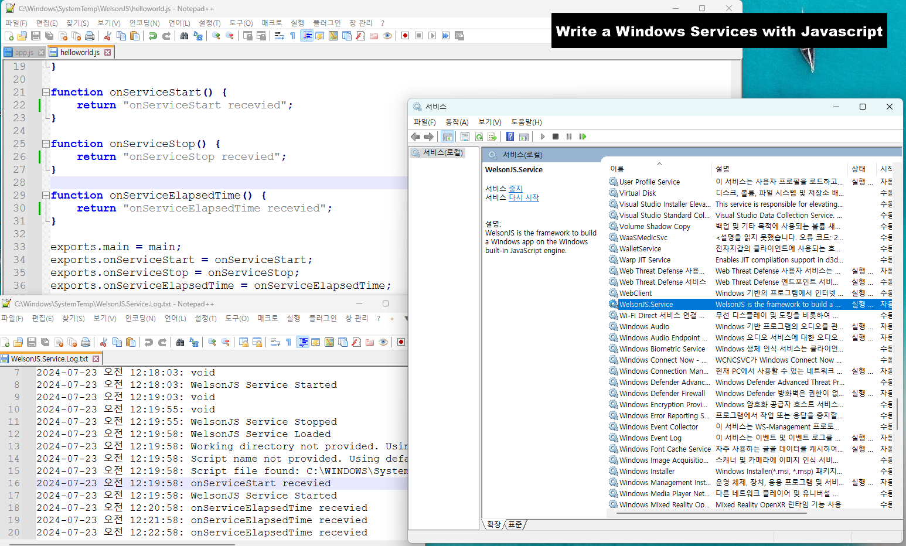
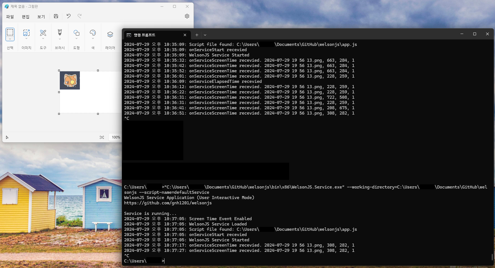
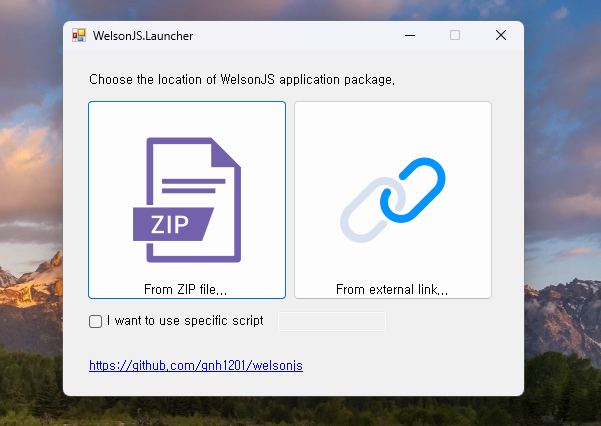

# welsonjs

[](https://app.fossa.com/projects/git%2Bgithub.com%2Fgnh1201%2Fwelsonjs?ref=badge_shield)
[](https://ci.appveyor.com/project/gnh1201/welsonjs)
[](https://doi.org/10.5281/zenodo.11382384)
[](https://www.slideshare.net/slideshow/welsonjs-2023/263181443)

 WelsonJS - Build a Windows app on the Windows built-in JavaScript engine.


Now, You can build an Windows desktop app with JavaScript, TypeScript, CoffeeScript, ReScript, and HTML/CSS on Windows built-in ECMAScript engine.

WelsonJS = ***W***indows + ***El***ectr***on***-like + ***Javascript(JS)*** + [Your contribution](https://github.com/sponsors/gnh1201)

Dual license notice: The default license for this project is GPL 3.0. However, if the GPL 3.0 license is not compatible with Microsoft products, it is subject to the MS-RL license.

## Sponsors
-  [GitHub Sponsors](https://github.com/sponsors/gnh1201)
-  Open Software Portal, Korea National Industry Promotion Agency - Awarded Prize
-  Free code signing provided by [SignPath.io](https://signpath.io), certificate by [SignPath Foundation](https://signpath.org/)

## [Partnerships](https://catswords-oss.rdbl.io/5719744820/8278298336)
- [ ScrapeOps (scrapeops.io)](https://scrapeops.io?fpr=namhyeon75) - Proxy Aggregator (1,000 free calls/month, [10% discount coupon](https://catswords-oss.rdbl.io/5719744820/8278298336))
- [ (searchapi.io)](https://www.searchapi.io/?via=namhyeon) - SERP (Google, Bing, Baidu, Amazon, YouTube, App Store (Google, Apple), etc.) scraping (100 free calls/month)

## Structure


## Specifications
- Built-in transpilers: [TypeScript](https://www.typescriptlang.org/), [Rescript](https://rescript-lang.org/), [CoffeeScript 2](https://coffeescript.org/), [LiveScript](https://livescript.net/)
- Ready to use on Windows machine immediately. No require additional software installation.
- ES5(ECMAScript 5), XML, JSON, YAML compatibility
  - [github.com/zloirock/core-js](https://github.com/zloirock/core-js)
  - [github.com/douglascrockford/JSON-js](https://github.com/douglascrockford/JSON-js) (aka. JSON2.js)
  - [github.com/nodeca/js-yaml](https://github.com/nodeca/js-yaml)
- HTML5, CSS3 compatibility
  - [github.com/aFarkas/html5shiv](https://github.com/aFarkas/html5shiv)
  - [github.com/parndt/jquery-html5-placeholder-shim](https://github.com/parndt/jquery-html5-placeholder-shim)
  - [github.com/scottjehl/Respond](https://github.com/scottjehl/Respond)
  - [github.com/keithclark/selectivizr](https://github.com/keithclark/selectivizr)
  - [github.com/arv/ExplorerCanvas](https://github.com/arv/ExplorerCanvas)
  - [github.com/Modernizr/Modernizr](https://github.com/Modernizr/Modernizr)
- CSS Frameworks
  - [github.com/jslegers/cascadeframework](https://github.com/jslegers/cascadeframework)
  - [github.com/golden-layout/golden-layout](https://github.com/golden-layout/golden-layout)
- WYSIWYG HTML Editor
  - [github.com/summernote/summernote](https://github.com/summernote/summernote)
- Included libraries
  - [jQuery](https://jquery.com/)
  - [jQuery UI](https://jqueryui.com/)
  - [github.com/kamranahmedse/jquery-toast-plugin](https://github.com/kamranahmedse/jquery-toast-plugin) - Highly customizable jquery plugin to show toast messages
  - [github.com/hiddentao/squel](https://github.com/hiddentao/squel) - SQL query string builder for Javascript
  - [github.com/BorisMoore/jsrender](https://github.com/BorisMoore/jsrender) - A lightweight, powerful and highly extensible templating engine. In the browser or on Node.js, with or without jQuery.
  - [github.com/mihaifm/linq](https://github.com/mihaifm/linq) - LINQ for JavaScript
  - [github.com/pegjs/pegjs](https://github.com/pegjs/pegjs) - PEG.js: Parser generator for JavaScript
- [module.exports](https://nodejs.org/api/modules.html#moduleexports), CommonJS, UMD compatibility
- [NPM](https://www.npmjs.com/) compatibility
- [Chrome DevTools Protocol](https://chromedevtools.github.io/devtools-protocol/) support
- [ADB(Android Debug Bridge)](https://source.android.com/docs/setup/build/adb) support
- RPC(Remote Procedure Call) protocol support
  - [gRPC](https://grpc.io/)
  - [JSON-RPC 2.0](https://www.jsonrpc.org/specification)

## Included modules
- lib/std (Standard library)
- lib/system (System interface)
- lib/base64 (BASE64 encode and decode)
- lib/file (File I/O interface)
- lib/http (HTTP/HTTPS client with [XHR(MSXML)](https://developer.mozilla.org/docs/Glossary/XMLHttpRequest), [cURL](https://curl.se/), [BITS](https://en.m.wikipedia.org/w/index.php?title=Background_Intelligent_Transfer_Service), [CERT](https://github.com/MicrosoftDocs/windowsserverdocs/blob/main/WindowsServerDocs/administration/windows-commands/certutil.md), [Web Proxy and SEO/SERP](https://app.rdbl.io/T0AB411UHDW9/S0VLKP4HKVGC/P0CC9H6ZSQCY))
- lib/registry (Windows Registry interface)
- lib/security (Windows Security Policy interface)
- lib/shell (Windows Shell (Command Prompt) interface)
- lib/powershell (Windows Powershell interface)
- lib/service (Windows Service interface)
- lib/browser (Modern web compatibility layer)
- lib/uri (URI scheme interface)
- lib/winlibs (Windows DLL(Dynamic-link library) interface)
- lib/autohotkey ([AutoHotkey](https://www.autohotkey.com/) interface)
- lib/autoit ([AutoIt3/AutoItX](https://www.autoitscript.com/) interface)
- lib/msoffice (Microsoft Office (e.g. Excel, PowerPoint, Word) interface)
- lib/gtk (GTK-server and GladeXML supported GUI interface)
- lib/chrome ([Chrome DevTools Protocol](https://chromedevtools.github.io/devtools-protocol/) based Chrome/Chromium web browser testing interface)
- lib/pipe-ipc (PIPE (e.g., File IO, Standard IO) based IPC(Inter-Process Communication) implementation)
- [WelsonJS.Toolkit](https://catswords-oss.rdbl.io/5719744820/0811015590) (DLL/COM component with .NET 2.0, For all Windows based systems)
  - User prompt methods (e.g., alert, confirm) implementation
  - Useful tools to control the windows and window handle (find, attach, trigger events. e.g., Virtual Human Interface
  - Cryptography ([ISO/IEC 18033-3:2010](https://www.iso.org/standard/54531.html) aka. [HIGHT](https://seed.kisa.or.kr/kisa/algorithm/EgovHightInfo.do))
  - [Named Shared Memory](https://learn.microsoft.com/en-us/windows/win32/memory/creating-named-shared-memory) based IPC(Inter-Process Communication) implementation [#](https://qiita.com/gnh1201/items/4e70dccdb7adacf0ace5)
- [WelsonJS.Service](https://catswords-oss.rdbl.io/5719744820/0811015590) (Windows Service Application, For recent Windows based systems)
  - Write a Windows Service Application with JavaScript
  - [File Event Monitor](https://catswords-oss.rdbl.io/5719744820/6159022056): Trace file creation, network connections, and registry modifications.
  - [Screen Time Feature](https://catswords-oss.rdbl.io/5719744820/8803957194): Find an image position on the computer screens or windows.
- [WelsonJS.Launcher](https://catswords-oss.rdbl.io/5719744820/4131485779) (Launcher Application, For recent Windows based systems)
  - This is a launcher app designed to easily distribute WelsonJS application packages (based on ZIP compression files).
- lib/chatgpt ([ChatGPT](https://openai.com/chatgpt) integration)
- Everything you can imagine.

## Make your own `sayhello` example

### 1. Write a file `lib/sayhello.js`
```js
// lib/sayhello.js
function say() {
    console.log("hello");
}

exports.say = say;

exports.VERSIONINFO = "SayHello Library (sayhello.js) version 0.1";
exports.AUTHOR = "abuse@catswords.net";   // e.g. YOUR EMAIL ADDRESS
exports.global = global;
exports.require = global.require;
```

### 2. Write a file `sayhello.js`
```js
// sayhello.js
var SayHello = require("lib/sayhello");

function main() {
    console.log("calling say()");
    SayHello.say();
    console.log("ended say()");
}

exports.main = main;
```

### 3. Execute file on the command prompt
```cmd
C:\Users\knh94\Documents\GitHub\welsonjs> cscript app.js sayhello
calling say()
hello
ended say()
```

## How to release my application?
The WelsonJS framework suggests the following application release methods:

- **Compress to Zip, and use the launcher**: Compress the files and directories necessary for running the project into a Zip file, and distribute it along with the [WelsonJS.Launcher](https://catswords-oss.rdbl.io/5719744820/4131485779).
- **Build a setup file**: Use [Inno Setup](https://jrsoftware.org/isinfo.php). Information needed to create the setup file (the `setup.iss` file) is already included.
- **Copy all directories and files**: This is the simplest and most straightforward method.

## Screenshots








## Thanks to
- Heavy-industry specialized CSP(Cloud Service Provider) in Republic of Korea - Use case establishment
- Live-commerce specialized online advertisement companies in Republic of Korea - Use case establishment
- Information security companies in Republic of Korea - Use case establishment
-  morioh.com - [Mentioned](https://morioh.com/a/23c427a82bf1/build-a-windows-desktop-apps-with-javascript-html-and-css)
-  CSDN - Mentioned
-  Qiita - Knowledge-base about WSH environment
-  Redsky Software - PoC(Proof of Concept) of the CommonJS on WSH environment
- Inspired by a small-sized JavaScript payload demonstrated by a cybersecurity related group.
- Inspired by the use of Named Shared Memory in an inter-language IPC implementation devised by an unidentified developer.
-  Fediverse - Mentioned
-  Hacker News - [Mentioned](https://news.ycombinator.com/item?id=41316782)
-  WebToolsWeekly - [Mentioned](https://webtoolsweekly.com/archives/issue-585/)

## Related links
- [gnh1201/wsh-js-gtk](https://github.com/gnh1201/wsh-js-gtk) - GTK GUI ported to Windows Scripting Host - Javascript (Microsoft JScript) (wsh-js)
- [gnh1201/wsh-json](https://github.com/gnh1201/wsh-json) - JSON stringify/parse (encode/decode) for Windows Scripting Host
- [redskyit/wsh-appjs](https://github.com/redskyit/wsh-appjs) - require-js and app framework for Windows Scripting Host JavaScript
- [JohnLaTwC's gist](https://gist.github.com/JohnLaTwC/4315bbbd89da0996f5c08c032b391799) - JavaScript RAT
- [JSMan-/JS-Framework](https://github.com/JSMan-/JS-Framework) - No description
- [iconjack/setTimeout-for-windows-script-host](https://github.com/iconjack/setTimeout-for-windows-script-host) - Replacement for the missing setTimeout and clearTimeout function in Windows Script Host
- [johnjohnsp1/WindowsScriptHostExtension](https://github.com/johnjohnsp1/WindowsScriptHostExtension) - Inject DLL Prototype using Microsoft.Windows.ACTCTX COM Object
- [kuntashov/jsunit](https://github.com/kuntashov/jsunit) - JSUnit port for Windows Scripting Host
- [nickdoth/WSHHttpServer](https://github.com/nickdoth/WSHHttpServer) - HTTP server based on Windows Script Host
- FOSSA report [HTML](https://ics.catswords.net/fossa_report.html) [CSV](https://ics.catswords.net/fossa_report.csv) [TXT](https://ics.catswords.net/fossa_report.txt)
- [License attributions of a stock images](https://policy.catswords.social/stock_images.html)

## Report abuse
- [GitHub Security Advisories](https://github.com/gnh1201/welsonjs/security)
- abuse@catswords.net
- ActivityPub [@catswords_oss@catswords.social](https://catswords.social/@catswords_oss)
- XMPP [catswords@conference.xmpp.catswords.net](xmpp:catswords@conference.xmpp.catswords.net?join)
- [Join Catswords on Microsoft Teams](https://teams.live.com/l/community/FEACHncAhq8ldnojAI)

## License
[](https://app.fossa.com/projects/git%2Bgithub.com%2Fgnh1201%2Fwelsonjs?ref=badge_large)
