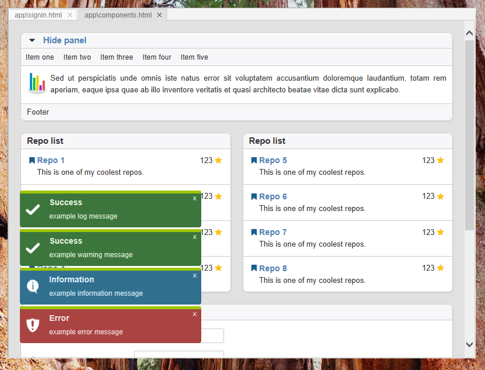
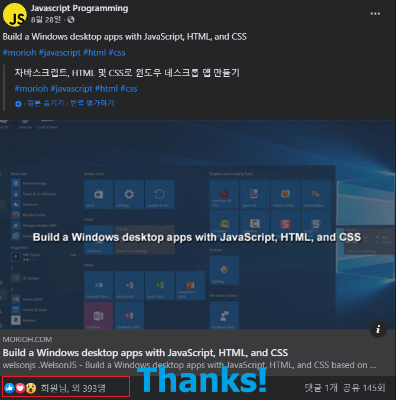

# welsonjs
WelsonJS - Build a Windows desktop apps with JavaScript, HTML, and CSS based on WSH/HTA or GTK.


[](https://www.buymeacoffee.com/catswords/thanks-welsonjs-users)

## Structure


## Specifications
- ES5(ECMAScript 5), XML, JSON, YAML compatibility
  - [github:zloirock/core-js](https://github.com/zloirock/core-js)
  - [github:douglascrockford/JSON-js](https://github.com/douglascrockford/JSON-js) (aka. JSON2.js)
  - [github:nodeca/js-yaml](https://github.com/nodeca/js-yaml)
- HTML5, CSS3 compatibility
  - [github:aFarkas/html5shiv](https://github.com/aFarkas/html5shiv)
  - [github:parndt/jquery-html5-placeholder-shim](https://github.com/parndt/jquery-html5-placeholder-shim)
  - [github:scottjehl/Respond](https://github.com/scottjehl/Respond)
  - [github:keithclark/selectivizr](https://github.com/keithclark/selectivizr)
  - [github:arv/ExplorerCanvas](https://github.com/arv/ExplorerCanvas)
  - [github:etianen/html5media](https://github.com/etianen/html5media)
  - [github:Modernizr/Modernizr](https://github.com/Modernizr/Modernizr)
- Default CSS Framework
  - [github:jslegers/cascadeframework](https://github.com/jslegers/cascadeframework)
- Included libraries
  - [jQuery](https://jquery.com/)
  - [jQuery UI](https://jqueryui.com/)
  - [github:kamranahmedse/jquery-toast-plugin](https://github.com/kamranahmedse/jquery-toast-plugin)
  - [github:hiddentao/squel](https://github.com/hiddentao/squel)
  - [github:BorisMoore/jsrender](https://github.com/BorisMoore/jsrender)
- [Includes binaries](https://github.com/gnh1201/welsonjs/blob/master/bin/README.MD)
- [module.exports](https://nodejs.org/en/knowledge/getting-started/what-is-require/), CommonJS, UMD compatibility
- [NPM](https://www.npmjs.com/) compatibility
- Ready to use on Windows machine immediately. No require additional softwares installation.

## Included libraries
- lib/std (Standard library)
- lib/system (System library)
- lib/base64 (BASE64 Encode and Decode)
- lib/db (Database interface)
- lib/file (File I/O interface)
- lib/http (HTTP interface)
- lib/json (JSON Encode and Decode)
- lib/registry (Windows Registry interface)
- lib/security (Security Policy interface)
- lib/sendmail (Sendmail interface with 3rdparty)
- lib/shell (Command Prompt interface)
- lib/timer (`setTimeout` polyfills)
- lib/powershell (Windows Powershell interface)
- lib/service (Windows Service interface)
- lib/oldbrowser (ES5/ES6, HTML/JS/CSS compatibility)
- lib/uri (URI scheme interface)
- lib/winlibs (Windows DLL(Dynamic-link library) interface)
- lib/autohotkey ([AutoHotkey](https://www.autohotkey.com/) interface)
- lib/autoit ([AutoIt3/AutoItX](https://www.autoitscript.com/) interface)
- lib/shadowsocks ([Shadowsocks](https://shadowsocks.org/) interface)
- lib/excel (Microsoft Excel interface)
- lib/vbscript (VBScript interface)
- lib/wintap (Windows-TAP interface)
- lib/tun2socks (TUN2SOCKS interface)
- lib/hosts (Hosts file interface)
- lib/gtk (GTK/GladeXML server GUI interface)
- lib/chrome (Chrome Web Browser Debugging interface)
- lib/toolkit (`WelsonJS.Toolkit` native component)
- lib/pipe-ipc (PIPE-based IPC(Inter-Process Communication) implementation)

## Make your own `sayhello` example

### 1. Write a file `lib/sayhello.js`
```
exports.VERSIONINFO = "SayHello Library (sayhello.js) version 0.1
exports.global = global;
exports.require = global.require;

exports.say = function() {
    console.log("hello");
}
```

### 2. Write a file `sayhello.js`
```
var SayHello = require("lib/sayhello");

function main() {
    console.log("calling say()");
    SayHello.say();
    console.log("ended say()");
}

exports.main = main;
```

### 3. Execute file on the command prompt
```
C:\Users\John\Documents\GitHub\welsonjs> cscript app.js sayhello
calling say()
hello
ended say()
```

## How to make your own setup file
- Please check `setup.iss` file it could be compile with [Inno Setup](https://jrsoftware.org/isinfo.php)

## Screenshots


## Thanks!


- https://www.facebook.com/javascript4u/posts/1484014618472735
- https://python5.com/q/xtbsqjxb

## Related projects
- [gnh1201/wsh-js-gtk](https://github.com/gnh1201/wsh-js-gtk) - GTK GUI ported to Windows Scripting Host - Javascript (Microsoft JScript) (wsh-js)
- [gnh1201/wsh-json](https://github.com/gnh1201/wsh-json) - JSON stringify/parse (encode/decode) for Windows Scripting Host
- [redskyit/wsh-appjs](https://github.com/redskyit/wsh-appjs) - require-js and app framework for Windows Scripting Host JavaScript
- [JohnLaTwC's gist](https://gist.github.com/JohnLaTwC/4315bbbd89da0996f5c08c032b391799) - JavaScript RAT
- [JSMan-/JS-Framework](https://github.com/JSMan-/JS-Framework) - No description
- [iconjack/setTimeout-for-windows-script-host](https://github.com/iconjack/setTimeout-for-windows-script-host) - Replacement for the missing setTimeout and clearTimeout function in Windows Script Host
- [johnjohnsp1/WindowsScriptHostExtension](https://github.com/johnjohnsp1/WindowsScriptHostExtension) - Inject DLL Prototype using Microsoft.Windows.ACTCTX COM Object
- [kuntashov/jsunit](https://github.com/kuntashov/jsunit) - JSUnit port for Windows Scripting Host
- [nickdoth/WSHHttpServer](https://github.com/nickdoth/WSHHttpServer) - HTTP server based on Windows Script Host

## Image stocks
- [7418_blocks_color_modules_rgb_square_icon](https://www.iconfinder.com/icons/7418/blocks_color_modules_rgb_square_icon) (Icon File) - Sergio Sanchesz Lopez, Futurosoft

## Contact me
- abuse@catswords.net
