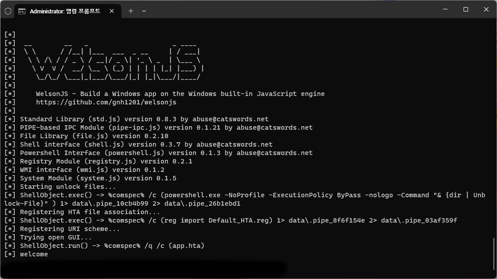
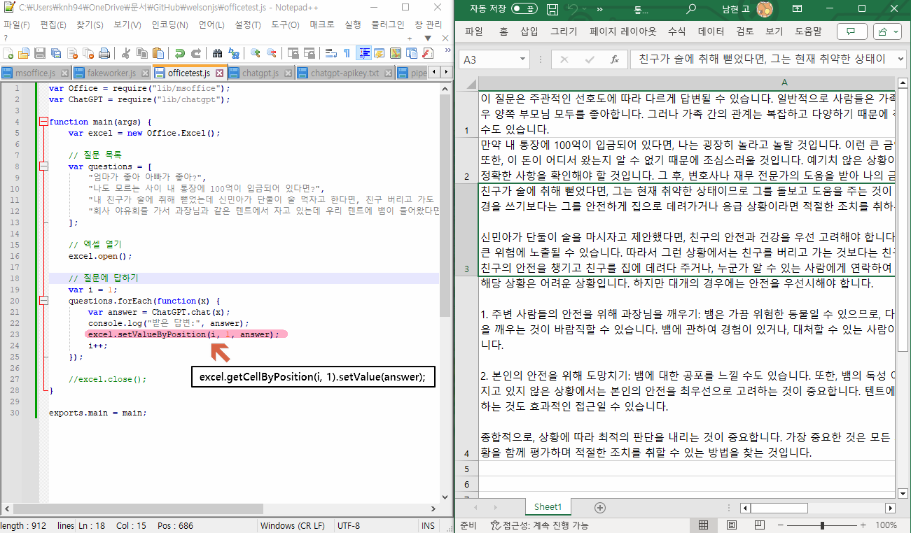

# welsonjs
WelsonJS - Build a Windows app on the Windows built-in JavaScript engine.


Now, You can build an Windows desktop app with JavaScript, TypeScript, CoffeeScript, ReScript, and HTML/CSS on Windows built-in ECMAScript engine.

WelsonJS = ***W***indows + ***El***ectr***on***-like + ***Javascript(JS)*** + [Your contribution](FUNDING.yml)

Dual license notice: The default license for this project is GPL 3.0. However, if the GPL 3.0 license is not compatible with Microsoft products, it is subject to the MS-RL license.

## Structure

[](https://app.fossa.com/projects/git%2Bgithub.com%2Fgnh1201%2Fwelsonjs?ref=badge_shield)

## Specifications
- Built-in transpilers: [TypeScript](https://www.typescriptlang.org/), [Rescript](https://rescript-lang.org/), [CoffeeScript 2](https://coffeescript.org/), [LiveScript](https://livescript.net/)
- Ready to use on Windows machine immediately. No require additional software installation.
- ES5(ECMAScript 5), XML, JSON, YAML compatibility
  - [github.com/zloirock/core-js](https://github.com/zloirock/core-js)
  - [github.com/douglascrockford/JSON-js](https://github.com/douglascrockford/JSON-js) (aka. JSON2.js)
  - [github.com/nodeca/js-yaml](https://github.com/nodeca/js-yaml)
- HTML5, CSS3 compatibility
  - [github.com/aFarkas/html5shiv](https://github.com/aFarkas/html5shiv)
  - [github.com/parndt/jquery-html5-placeholder-shim](https://github.com/parndt/jquery-html5-placeholder-shim)
  - [github.com/scottjehl/Respond](https://github.com/scottjehl/Respond)
  - [github.com/keithclark/selectivizr](https://github.com/keithclark/selectivizr)
  - [github.com/arv/ExplorerCanvas](https://github.com/arv/ExplorerCanvas)
  - [github.com/Modernizr/Modernizr](https://github.com/Modernizr/Modernizr)
- Default CSS Framework
  - [github.com/jslegers/cascadeframework](https://github.com/jslegers/cascadeframework)
- WYSIWYG HTML Editor
  - [github.com/summernote/summernote](https://github.com/summernote/summernote)
- Included libraries
  - [jQuery](https://jquery.com/)
  - [jQuery UI](https://jqueryui.com/)
  - [github.com/kamranahmedse/jquery-toast-plugin](https://github.com/kamranahmedse/jquery-toast-plugin)
  - [github.com/hiddentao/squel](https://github.com/hiddentao/squel)
  - [github.com/BorisMoore/jsrender](https://github.com/BorisMoore/jsrender)
- [Includes binaries](https://github.com/gnh1201/welsonjs/blob/master/bin/README.MD)
- [module.exports](https://nodejs.org/en/knowledge/getting-started/what-is-require/), CommonJS, UMD compatibility
- [NPM](https://www.npmjs.com/) compatibility
- [Chrome DevTools Protocol](https://chromedevtools.github.io/devtools-protocol/) support
- [gRPC](https://grpc.io/) protocol support

## Included modules
- lib/std (Standard library)
- lib/system (System interface)
- lib/base64 (BASE64 encode and decode)
- lib/file (File I/O interface)
- lib/http (HTTP client with MSXML/cURL)
- lib/registry (Windows Registry interface)
- lib/security (Windows Security Policy interface)
- lib/shell (Windows Shell (Command Prompt) interface)
- lib/powershell (Windows Powershell interface)
- lib/service (Windows Service interface)
- lib/browser (Modern web compatibility layer)
- lib/uri (URI scheme interface)
- lib/winlibs (Windows DLL(Dynamic-link library) interface)
- lib/autohotkey ([AutoHotkey](https://www.autohotkey.com/) interface)
- lib/autoit ([AutoIt3/AutoItX](https://www.autoitscript.com/) interface)
- lib/msoffice (Microsoft Office (e.g. Excel, PowerPoint, Word) interface)
- lib/gtk (GTK-server and GladeXML supported GUI interface)
- lib/chrome ([Chrome DevTools Protocol](https://chromedevtools.github.io/devtools-protocol/) based Chrome/Chromium web browser testing interface)
- lib/pipe-ipc (PIPE-based IPC(Inter-Process Communication) implementation)
- lib/toolkit (`WelsonJS.Toolkit` native component)
  - Find and attach a handle of the window
  - alert(), prompt() implementation in console mode
  - Virtualized Human Interfaces
  - Cryptography
  - [Named Shared Memory](https://learn.microsoft.com/en-us/windows/win32/memory/creating-named-shared-memory) based IPC(Inter-Process Communication) implementation
- lib/chatgpt ([ChatGPT](https://openai.com/chatgpt) integration)
- Everything you can imagine.

## Make your own `sayhello` example

### 1. Write a file `lib/sayhello.js`
```js
// lib/sayhello.js
function say() {
    console.log("hello");
}

exports.say = say;

exports.VERSIONINFO = "SayHello Library (sayhello.js) version 0.1";
exports.AUTHOR = "abuse@catswords.net";   // e.g. YOUR EMAIL ADDRESS
exports.global = global;
exports.require = global.require;
```

### 2. Write a file `sayhello.js`
```js
// sayhello.js
var SayHello = require("lib/sayhello");

function main() {
    console.log("calling say()");
    SayHello.say();
    console.log("ended say()");
}

exports.main = main;
```

### 3. Execute file on the command prompt
```cmd
C:\Users\oss\Documents\GitHub\welsonjs> cscript app.js sayhello
calling say()
hello
ended say()
```

## How to make your own setup file
- Please check `setup.iss` file it could be compile with [Inno Setup](https://jrsoftware.org/isinfo.php)

## Screenshots






## Thanks to
-  Open Software Portal, Korea National Industry Promotion Agency - Awarded Prize
- Heavy-industry specialized CSP(Cloud Service Provider) in Republic of Korea - Use case establishment
- Live-commerce specialized online advertisement companies in Republic of Korea - Use case establishment
- Information security companies in Republic of Korea - Use case establishment
-  morioh.com - Mentioned
-  CSDN - Mentioned
-  Qiita - Knowledge-base about WSH environment
-  Redsky Software - PoC(Proof of Concept) of the CommonJS on WSH environment
- Inspired by a small-sized JavaScript payload demonstrated by a cybersecurity related group.
- Inspired by the use of Named Shared Memory in an inter-language IPC implementation devised by an unidentified developer.
-  Fediverse - Mentioned

## Related projects
- [gnh1201/wsh-js-gtk](https://github.com/gnh1201/wsh-js-gtk) - GTK GUI ported to Windows Scripting Host - Javascript (Microsoft JScript) (wsh-js)
- [gnh1201/wsh-json](https://github.com/gnh1201/wsh-json) - JSON stringify/parse (encode/decode) for Windows Scripting Host
- [redskyit/wsh-appjs](https://github.com/redskyit/wsh-appjs) - require-js and app framework for Windows Scripting Host JavaScript
- [JohnLaTwC's gist](https://gist.github.com/JohnLaTwC/4315bbbd89da0996f5c08c032b391799) - JavaScript RAT
- [JSMan-/JS-Framework](https://github.com/JSMan-/JS-Framework) - No description
- [iconjack/setTimeout-for-windows-script-host](https://github.com/iconjack/setTimeout-for-windows-script-host) - Replacement for the missing setTimeout and clearTimeout function in Windows Script Host
- [johnjohnsp1/WindowsScriptHostExtension](https://github.com/johnjohnsp1/WindowsScriptHostExtension) - Inject DLL Prototype using Microsoft.Windows.ACTCTX COM Object
- [kuntashov/jsunit](https://github.com/kuntashov/jsunit) - JSUnit port for Windows Scripting Host
- [nickdoth/WSHHttpServer](https://github.com/nickdoth/WSHHttpServer) - HTTP server based on Windows Script Host

## Image stocks
- [7418_blocks_color_modules_rgb_square_icon](https://www.iconfinder.com/icons/7418/blocks_color_modules_rgb_square_icon) (Icon File) - Sergio Sanchesz Lopez, Futurosoft

## Report abuse
- abuse@catswords.net
- ActivityPub [@catswords_oss@catswords.social](https://catswords.social/@catswords_oss)


## License
[](https://app.fossa.com/projects/git%2Bgithub.com%2Fgnh1201%2Fwelsonjs?ref=badge_large)