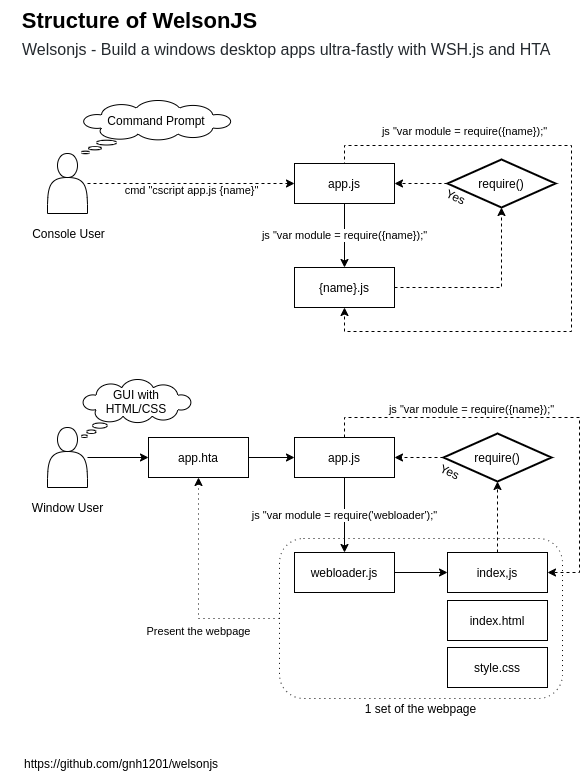

# welsonjs
WelsonJS - Build a Windows desktop apps with JavaScript, HTML, and CSS based on WSH/HTA

## Structure


## Specifications
- ES5(ECMAScript 5), ES6(ECMAScript 6) compatibility with [es5-shim](https://catswords.re.kr/go/es5shim), [es6-shim](https://catswords.re.kr/go/es6shim), and [json3](https://catswords.re.kr/go/json3)
- HTML5/CSS3 compatibility with [html5shiv](https://catswords.re.kr/go/html5shiv), [jquery-html5-placeholder-shim](https://catswords.re.kr/go/placeholdershim), [respond](https://catswords.re.kr/go/respondjs), [selectivizr](https://catswords.re.kr/go/selectivizrjs), [excanvas](https://catswords.re.kr/go/excanvasjs), [html5media](https://catswords.re.kr/go/html5media), and [modernizr](https://catswords.re.kr/go/modernizrjs)
- [module.exports](https://catswords.re.kr/go/whatisrequire)(Node) styled module implementation, and managing packages with [NPM(Node Package Manager)](https://catswords.re.kr/go/npmjs)
- Ready to use on Windows machine immediately. No require additional softwares installation.

## Included libraries
- lib/std (Standard library)
- lib/system (System library)
- lib/base64 (BASE64 Encode and Decode)
- lib/db (Database interface)
- lib/file (File I/O interface)
- lib/http (HTTP interface)
- lib/json (JSON Encode and Decode)
- lib/registry (Windows Registry interface)
- lib/security (Security Policy interface)
- lib/sendmail (Sendmail interface with 3rdparty)
- lib/shell (Command Prompt interface)
- lib/timer (`setTimeout` implementation for not supported environment)
- lib/powershell (Windows Powershell interface)
- lib/service (Windows Service interface)
- lib/oldbrowser (HTML/JS/CSS interface)
- lib/uri (URI scheme interface)
- lib/winlibs (Windows DLL(Dynamic-link library) interface)
- lib/autohotkey ([AutoHotKey](https://catswords.re.kr/go/autohotkey) interface)
- lib/autoit3 ([AutoIt3](https://catswords.re.kr/go/autoit3) interface)
- lib/cloudflare ([Cloudflare Argo Tunnel](https://catswords.re.kr/go/argotunnel) interface)
- lib/shadowsocks ([Shadowsocks](https://catswords.re.kr/go/shadowsocks) interface)
- lib/excel (Microsoft Excel interface)

## Make your own `sayhello` example

### 1. Write a file `lib/sayhello-lib.js`
```
exports.VERSIONINFO = "sayhello library (sayhello-lib.js) version 0.1
exports.global = global;
exports.require = global.require;

exports.say = function() {
    console.log("hello");
}
```

### 2. Write a file `sayhello.js`
```
var sayhello = require("lib/sayhello-lib");
exports.main = function() {
    sayhello.say();
};
```

### 3. Execute file on the command prompt
```
C:\Users\John\Documents\GitHub\welsonjs> cscript app.js sayhello
hello
```

## Related projects
- [gnh1201/wsh-js-gtk](https://catswords.re.kr/go/wshjsgtk) - GTK GUI ported to Windows Scripting Host - Javascript (Microsoft JScript) (wsh-js)
- [gnh1201/wsh-json](https://catswords.re.kr/go/wshjson) - JSON stringify/parse (encode/decode) for Windows Scripting Host
- [redskyit/wsh-appjs](https://catswords.re.kr/go/wshappjs) - require-js and app framework for Windows Scripting Host JavaScript
- [JohnLaTwC's gist](https://catswords.re.kr/go/johnlatwcgist) - JavaScript RAT
- [JSMan-/JS-Framework](https://catswords.re.kr/go/jsmanfw) - No description
- [iconjack/setTimeout-for-windows-script-host](https://catswords.re.kr/go/wshtimer) - Replacement for the missing setTimeout and clearTimeout function in Windows Script Host
- [johnjohnsp1/RegistrationFreeCOM](https://catswords.re.kr/go/actctx) - Inject DLL Prototype using Microsoft.Windows.ACTCTX COM Object
- [kuntashov/jsunit](https://catswords.re.kr/go/wshjsunit) - JSUnit port for Windows Scripting Host

## Contact me
- gnh1201@gmail.com
